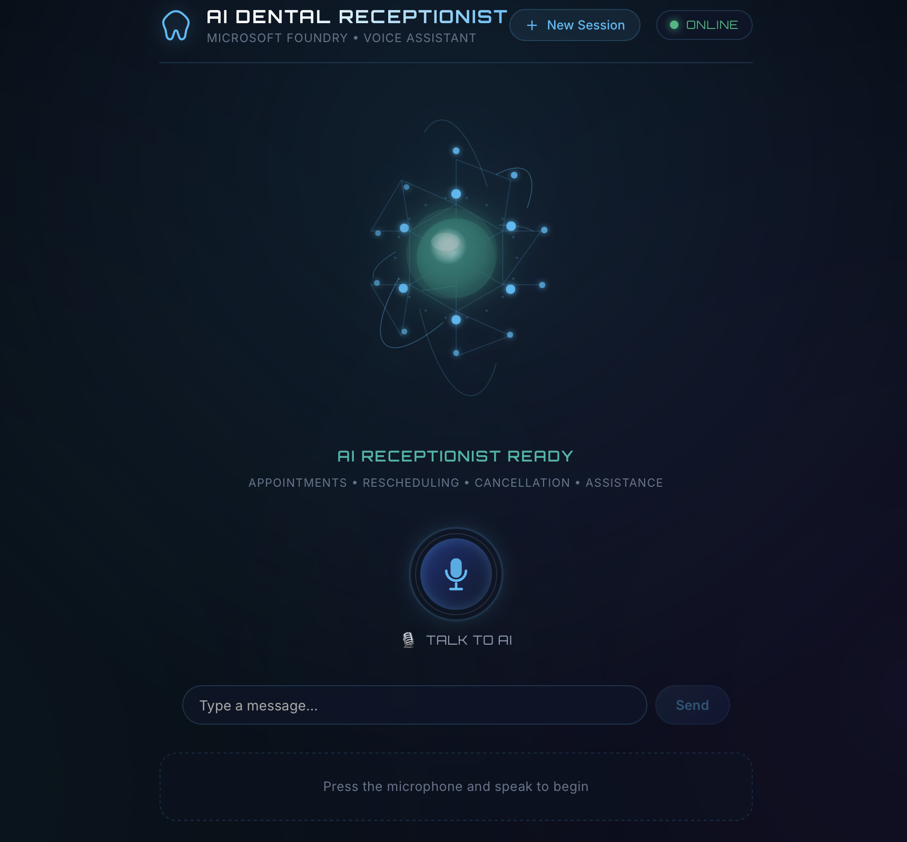

# Voice Dental Receptionist — AI Console

A futuristic, voice-first React single-page application (SPA) powered by Vite that serves as a thin presentation layer over an ASP.NET Core Web API exposing a Microsoft Foundry AI dental receptionist agent.



---

## 🌟 Overview

The **Voice Dental Receptionist AI Console** provides a JARVIS-inspired, hands-free conversational interface for dental patients to book, reschedule, or cancel appointments and ask clinic questions. 

Unlike traditional text-heavy chatbots, this application is built voice-first around a central animated **AI Neural Core** with real-time speech recognition (STT) and human-like natural speech synthesis (TTS).

---

## ✨ Features

- 🎙️ **Voice-First Interaction**: Hands-free conversation using the Web Speech API (`en-IN` locale).
- 🧠 **Animated Sci-Fi Neural Core**: Custom SVG + CSS animated core with 6 distinct visual states:
  - `INITIALIZING` — Slow rotation & gentle glow.
  - `READY` — Subtle breathing pulse.
  - `LISTENING` — Reactive outer ring pulse & live speech waveform.
  - `PROCESSING` — Rapid node connections & accelerating rings.
  - `SPEAKING` — Dynamic audio waveform & core pulsing.
  - `ERROR` — Subdued warning glow.
- 📱 **Smart Phone Number Speech Normalization**: Automatically converts 10-digit mobile numbers into space-separated single digits (`8 5 3 6...`) for TTS so they are spoken as individual numbers rather than large cardinal quantities ("85 crores...").
- 🗣️ **Human-Like Voice Selection**: Smart scoring algorithm prioritizes Neural, Natural, Google, Microsoft, and Apple Enhanced voices over legacy robotic synthesizers.
- ⚡ **Pure Thin-Client Architecture**: Zero business or agent logic in React. All orchestration, tool calling, and appointment logic reside entirely in the ASP.NET Core backend.
- 🛡️ **Built-in CORS & Proxy Fallback**: Integrated Vite proxy routes `/api` seamlessly to `http://localhost:5080` to eliminate browser cross-origin errors during development.
- 📱 **Fully Responsive & Accessible**: Custom glassmorphism UI with Orbitron & Inter typography, keyboard support, and mobile optimization.

---

## 🏗️ Architecture

```
                    ┌─────────────────────────┐
                    │      React UI SPA       │
                    │                         │
                    │   AI Neural Core        │
                    │   Speech Recognition    │
                    │   Conversation History  │
                    │   Speech Synthesis      │
                    └───────────┬─────────────┘
                                │
                                │ HTTP (Fetch API)
                                ▼
                    ┌─────────────────────────┐
                    │   ASP.NET Core API      │
                    │                         │
                    │ /api/conversations      │
                    │ /api/conversations/{id} │
                    │       /messages         │
                    └───────────┬─────────────┘
                                │
                                ▼
                    ┌─────────────────────────┐
                    │ Microsoft Foundry       │
                    │                         │
                    │ DentalReceptionist-     │
                    │ Phase2 Agent            │
                    └───────────┬─────────────┘
                                │
                         Function Tools
                                │
                  ┌─────────────┴─────────────┐
                  ▼                           ▼
           AppointmentTools             CallbackTools
```

---

## 🛠️ Technology Stack

- **Framework**: React 18
- **Build Tool**: Vite 5
- **Styling**: Modern CSS3 (Custom Properties, Glassmorphism, SVG Animations)
- **Speech-to-Text**: Web Speech API (`SpeechRecognition` / `webkitSpeechRecognition`)
- **Text-to-Speech**: Browser Speech Synthesis API (`SpeechSynthesisUtterance`)
- **HTTP Client**: Native Fetch API

---

## 🚀 Getting Started

### Prerequisites

- **Node.js**: v18.0.0 or higher
- **npm**: v9.0.0 or higher
- **Running Backend API**: ASP.NET Core API running at `http://localhost:5080`

### Installation

1. **Clone or open the repository**:
   ```bash
   cd "JarvisVoiceAgent"
   ```

2. **Install dependencies**:
   ```bash
   npm install
   ```

3. **Configure Environment Variables**:
   Copy `.env.example` to `.env`:
   ```bash
   cp .env.example .env
   ```
   Ensure `.env` contains your backend API URL:
   ```env
   VITE_API_BASE_URL=http://localhost:5080
   ```

4. **Start the Development Server**:
   ```bash
   npm run dev
   ```
   Open **`http://localhost:5173`** in your browser.

5. **Build for Production**:
   ```bash
   npm run build
   ```

---

## 📡 API Contract

The frontend communicates with two core endpoints exposed by the ASP.NET Core Web API:

### 1. Create Conversation Session
- **Endpoint**: `POST /api/conversations`
- **Response**:
  ```json
  {
    "conversationId": "5b0225412707"
  }
  ```

### 2. Send Message
- **Endpoint**: `POST /api/conversations/{conversationId}/messages`
- **Request**:
  ```json
  {
    "message": "I want to book a dental appointment for tomorrow at 5 PM"
  }
  ```
- **Response**:
  ```json
  {
    "conversationId": "5b0225412707",
    "message": "Sure — I can help book that. Do you mean 20th August 2026?",
    "agent": "DentalReceptionist-Phase2"
  }
  ```

---

## 📁 Project Structure

```
JarvisVoiceAgent/
├── public/
│   └── favicon.svg                # Neural core SVG icon
├── src/
│   ├── components/
│   │   ├── AIHeader.jsx           # Sci-fi top bar with status indicator & reset
│   │   ├── NeuralCore.jsx         # Animated 3D-effect SVG neural core
│   │   ├── VoiceButton.jsx        # Circular glowing microphone button
│   │   ├── ConversationPanel.jsx  # Chat bubble history & thinking indicator
│   │   ├── MessageBubble.jsx      # Role-styled User vs. AI message bubbles
│   │   ├── SessionInfo.jsx        # Expandable session & agent details panel
│   │   └── StatusIndicator.jsx    # Connection status badge
│   ├── hooks/
│   │   ├── useSpeechRecognition.js # STT hook (en-IN) with single-fire guarantee
│   │   └── useSpeechSynthesis.js   # TTS hook with voice selection & digit formatting
│   ├── services/
│   │   ├── api.js                 # Fetch wrapper with CORS & proxy fallback
│   │   └── conversationService.js # API endpoints integration
│   ├── styles/
│   │   └── app.css                # Sci-fi design system & animation rules
│   ├── App.jsx                    # State machine orchestrator & lifecycle
│   └── main.jsx                   # React DOM root entry
├── .env.example                   # Environment configuration template
├── package.json                   # Project dependencies & scripts
├── vite.config.js                 # Vite bundler & proxy configuration
└── README.md                      # Documentation
```

---

## ❓ Troubleshooting

### Microphone access is denied
- Click the camera/microphone icon in your browser address bar and grant permission.
- Use HTTPS or `http://localhost` (Web Speech API requires a secure context).

### Unable to connect to AI Receptionist
- Ensure your ASP.NET Core API is running at `http://localhost:5080`.
- Vite automatically proxies `/api` requests to port `5080`. If your backend runs on a different port, update `VITE_API_BASE_URL` in `.env` and `vite.config.js`.

---

## 📄 License

This project is open-source and intended for demonstration purposes with Microsoft Foundry AI services.
